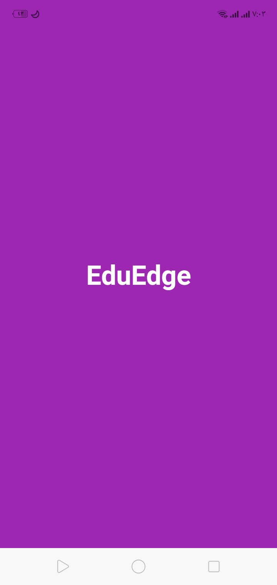
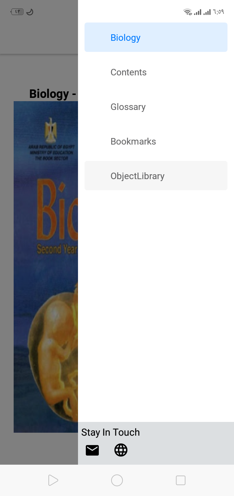
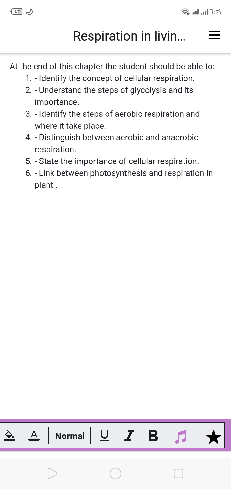
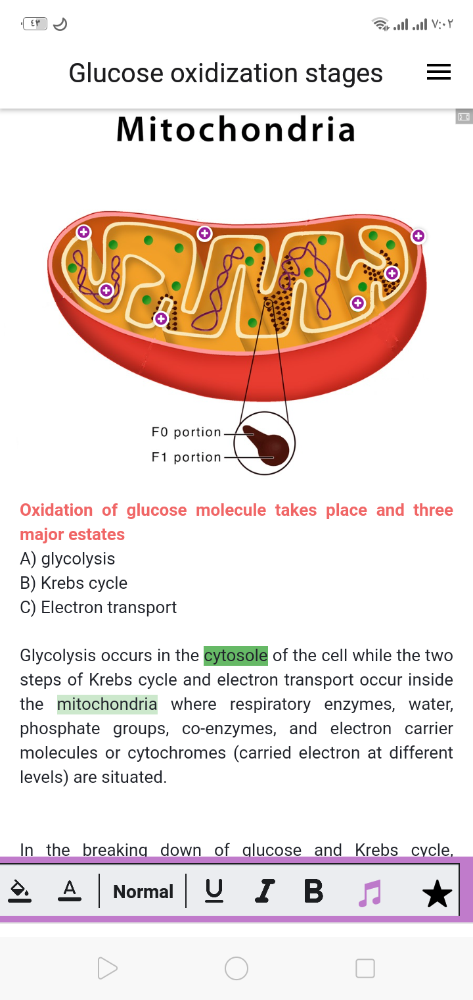
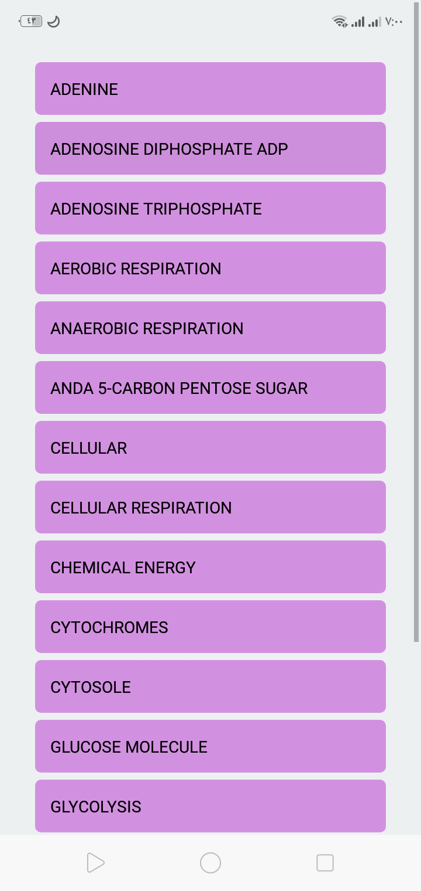
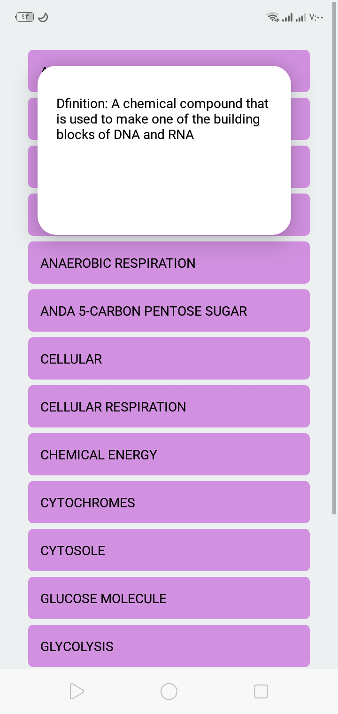
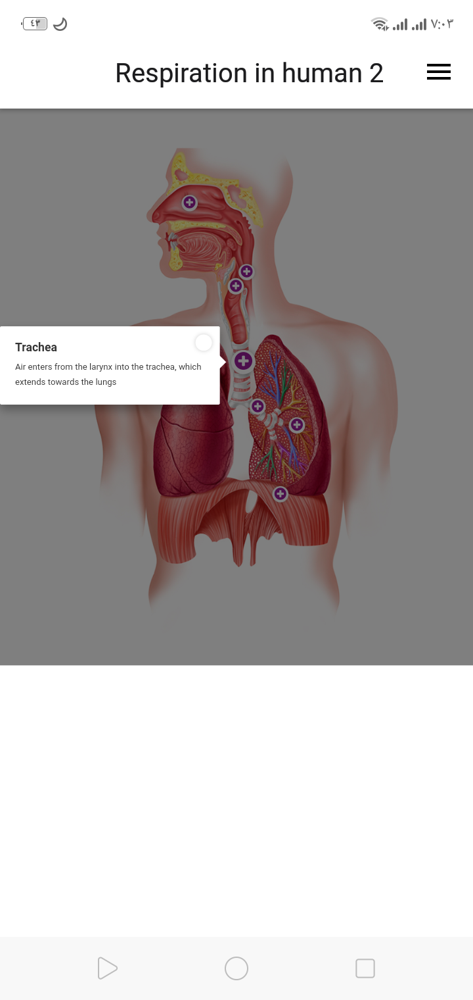

# Graduation_Project_Smart_Interactive_Book
mobile application for smart  learning using react native , it provide interactive books with user containing some features like : reading book , listing to chapter , bookmark some pages  , videos , interactive images and section for glossary 
# React Native App with Expo

This is a sample README.md file that provides instructions on how to run a React Native app using Expo, set it up on VS Code, and use Expo Go as an emulator.

## Prerequisites

Make sure you have the following software installed on your machine:

- Node.js: [Download and install Node.js](https://nodejs.org)
- Expo CLI: Install Expo CLI globally by running `npm install -g expo-cli`
- VS Code: [Download and install VS Code](https://code.visualstudio.com)

## Project Setup

1. Clone the project repository to your local machine:

2. Navigate to the project directory

3. Install project dependencies run:

## `npm install`

## Running the App

1. Open the project in VS Code and open the integrated terminal in VS Code
Click on the "View" menu in the top navigation.
Select "Terminal" from the dropdown menu.
Alternatively, you can use the keyboard shortcut Ctrl + to open the terminal.

2. Start the development server run:
## `expo start`

3. The Metro Bundler will start and display a QR code in the terminal.

4. Download Expo Go on your mobile device:
- [Expo Go for iOS](https://apps.apple.com/us/app/expo-go/id982107779)
- [Expo Go for Android](https://play.google.com/store/apps/details?id=host.exp.exponent)

5. Launch Expo Go on your mobile device and scan the QR code displayed in the terminal. This will load and run the app on your device.

6. You should now see your React Native app running on your mobile device using Expo Go.

## User's Source Code

If you have the source code on your machine:

1. Replace `<repository-url>` in step 1 of the Project Setup section with the path to your local project directory.

2. Follow the remaining steps to run the app and use Expo Go as an emulator.

## Additional Configuration

- To customize your app and add features, refer to the project's documentation or source code.

- For deployment and publishing instructions, consult the Expo documentation.

## Learn More

- [Expo Documentation](https://docs.expo.dev)
- [React Native Documentation](https://reactnative.dev)

<<<<<<< HEAD
<<<<<<< HEAD

=======
 

